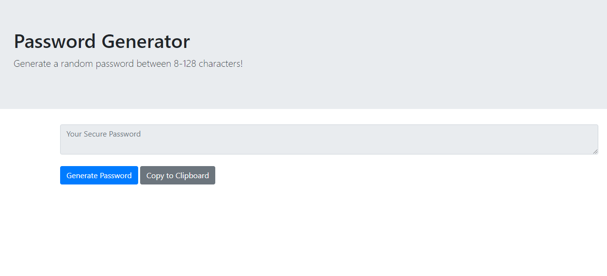

# Password Generator

## Description
This application was created for homework assignment #3 at the Coding Boot Camp at Johns Hopkins University. This is my first website using JavaScript to dynamically update HTML and CSS elements. 

After clicking "Generate Password", the user is prompted to select a password length between 8-128 characters, and then choose which character types they would like to include. Once the password has been generated, it can be copied to the clipboard. 

Link to site: https://jordynsaltzman.github.io/password-gen/ 

Here is a current screenshot of the page:

## Acknowledgements
This website was created as part of the Johns Hopkins Coding Bootcamp curriculum. Thank you to my instructors, Stetson Lewis and Donald Hesler, for providing direction and assistance. 

## License 

MIT License

Copyright (c) 2019 Jordyn Saltzman

Permission is hereby granted, free of charge, to any person obtaining a copy
of this software and associated documentation files (the "Software"), to deal
in the Software without restriction, including without limitation the rights
to use, copy, modify, merge, publish, distribute, sublicense, and/or sell
copies of the Software, and to permit persons to whom the Software is
furnished to do so, subject to the following conditions:

The above copyright notice and this permission notice shall be included in all
copies or substantial portions of the Software.

THE SOFTWARE IS PROVIDED "AS IS", WITHOUT WARRANTY OF ANY KIND, EXPRESS OR
IMPLIED, INCLUDING BUT NOT LIMITED TO THE WARRANTIES OF MERCHANTABILITY,
FITNESS FOR A PARTICULAR PURPOSE AND NONINFRINGEMENT. IN NO EVENT SHALL THE
AUTHORS OR COPYRIGHT HOLDERS BE LIABLE FOR ANY CLAIM, DAMAGES OR OTHER
LIABILITY, WHETHER IN AN ACTION OF CONTRACT, TORT OR OTHERWISE, ARISING FROM,
OUT OF OR IN CONNECTION WITH THE SOFTWARE OR THE USE OR OTHER DEALINGS IN THE
SOFTWARE.
